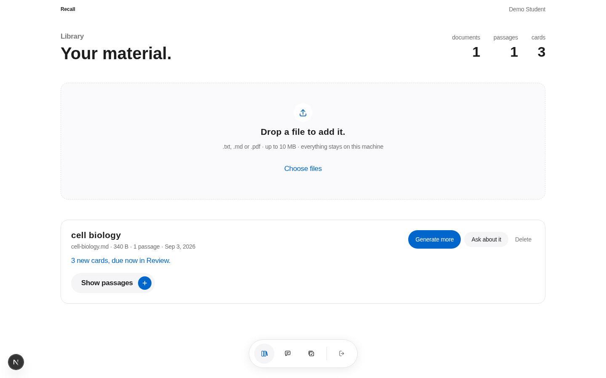
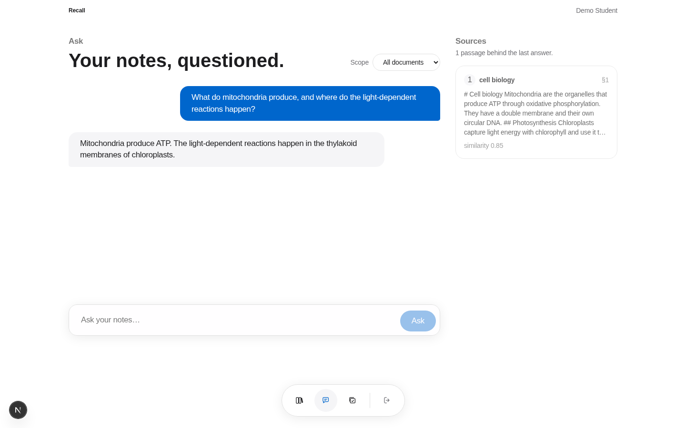
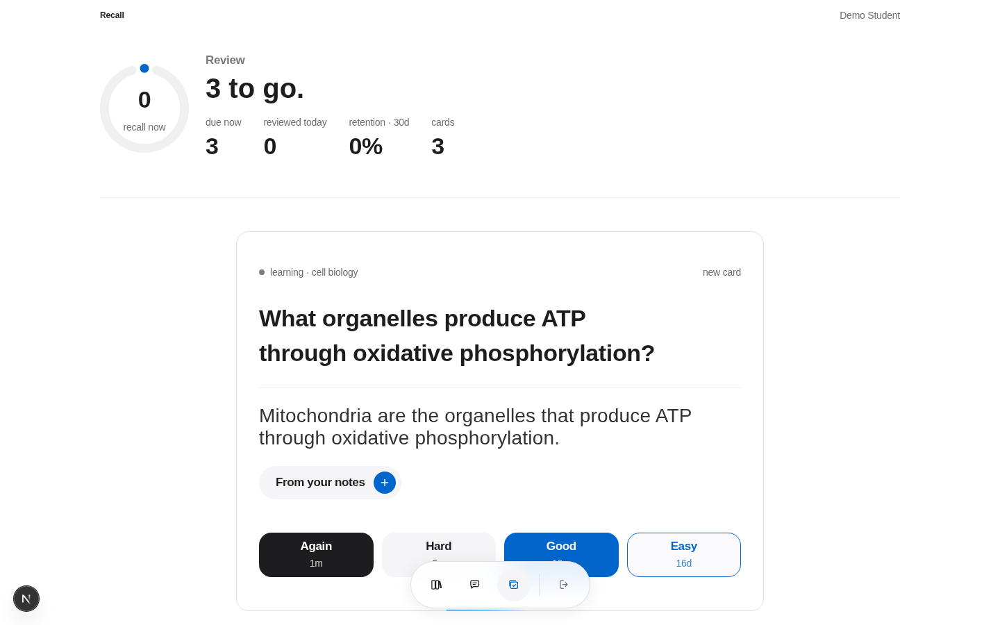

# Recall

An AI study assistant that turns your own notes into a spaced-repetition
practice loop. Built to the Apple design language, against the
[iPhone Air page](https://www.apple.com/ma/iphone-air/) as the visual reference.


## Try it

Two processes. The API first, because the web app calls it.

```bash
# terminal 1 — API on :8100
cd api
uv venv --python 3.12 && uv pip install -r requirements.txt
cp .env.example .env      # then put a real SESSION_SECRET in it:
                          # python -c "import secrets; print(secrets.token_urlsafe(48))"
.venv/bin/python -m app.seed          # creates the demo account
.venv/bin/python -m uvicorn app.main:app --port 8100

# terminal 2 — web on :3100
cd web
pnpm install
cp .env.example .env.local
pnpm dev --port 3100
```

Then open **http://localhost:3100** and sign in:

| | |
|---|---|
| Email | `demo@recall.study` |
| Password | `study-out-loud-2026` |

Seeded by [`api/app/seed.py`](api/app/seed.py), which is idempotent — running it
again resets that password rather than failing.

## See it work

[`docs/workflow.md`](docs/workflow.md) walks the whole product end to end with screenshots from a real run — credentials, start commands, every screen, the API, the models, and what to do when something looks wrong.

## What works today

| | |
|---|---|
| Library | drop `.txt` / `.md` / `.pdf`; it is chunked and embedded locally (nomic-embed-text through Ollama). One click writes flashcards from every passage. |
| Ask | answers stream in over SSE; the passages they came from appear first, numbered, and every `[n]` in the answer is a chip that lights up its source. A question your notes do not cover gets a fixed refusal, decided by retrieval before any model is asked. |
| Review | FSRS-5: stability, difficulty, retrievability per card. Four ratings, each showing the interval it would produce; Space and 1–4 on the keyboard; a deck-wide recall gauge. |
| Landing | the reference page's grammar, with the product shown working: live miniatures of chat and review inside Safari and iPhone frames, a bento of four differences, blur-fade reveals, number tickers, a macOS-style dock for the app's navigation — the MagicUI components, vendored and re-coloured to the design tokens. |
| Auth | registration, login, logout, `/auth/me` — argon2id hashing, signed HttpOnly session cookies, server-side session records. |
| Tests | 93 API tests (auth, documents, chat, FSRS, cards); 76 design-token assertions; `next build`, `tsc` and `eslint` clean. |





Models: `llama3.2:3b` answers in seconds on a CPU; set `CHAT_MODEL=qwen3:8b` in
`api/.env` for better answers. Both need `ollama pull`.

## Design

The visual reference is the iPhone Air product page.
[`docs/design-language.md`](docs/design-language.md) is the token specification;
[`docs/design-divergences.md`](docs/design-divergences.md) records the four
places the live page contradicts it — chrome carrying a shadow, 40px headings at
weight 400 rather than 600, two-tone body copy, and a white top bar instead of
black. The code follows the live page and says so.

`pnpm test:tokens` parses the specification's front matter and fails if the CSS
drifts from it, including any hex literal outside the token layer.

## Security notes

- **argon2id**, not bcrypt. bcrypt silently truncates at 72 bytes, which turns a
  long passphrase into a shorter one without telling anyone. There is a test
  proving argon2 does not.
- **Sessions are server-side rows**; the cookie carries only a signed row id.
  That is what makes logout real — deleting the row ends the session, where a
  self-contained token stays valid until it expires no matter what the server
  thinks. There is a test that a copied cookie stops working after logout.
- **HttpOnly**, so an XSS bug cannot read the session. This is why the token is
  not in `localStorage`.
- **Login failures are indistinguishable.** A wrong password and an unknown
  address return the same status and the same body, so the form is not an
  account-enumeration oracle. There is a test asserting the two responses are
  byte-identical.
- **`SESSION_SECRET` has no default.** A signing key with a default is a signing
  key everyone knows, and every cookie the service ever issued would be
  forgeable.

## Tests

```bash
cd api && .venv/bin/python -m pytest      # 15 passed
cd web && pnpm test:tokens                # 76 checks
cd web && pnpm build                      # TypeScript strict, no errors
```

---

Author: **Oussama Ezitouni**
