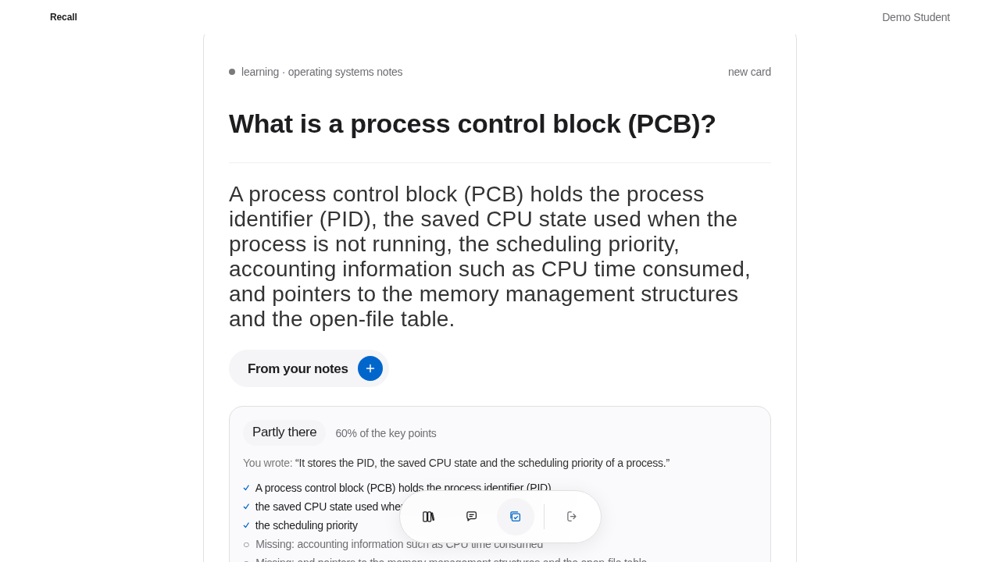
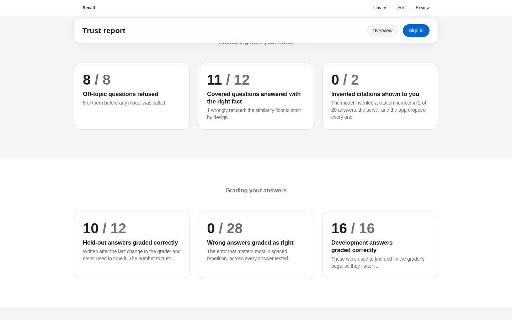
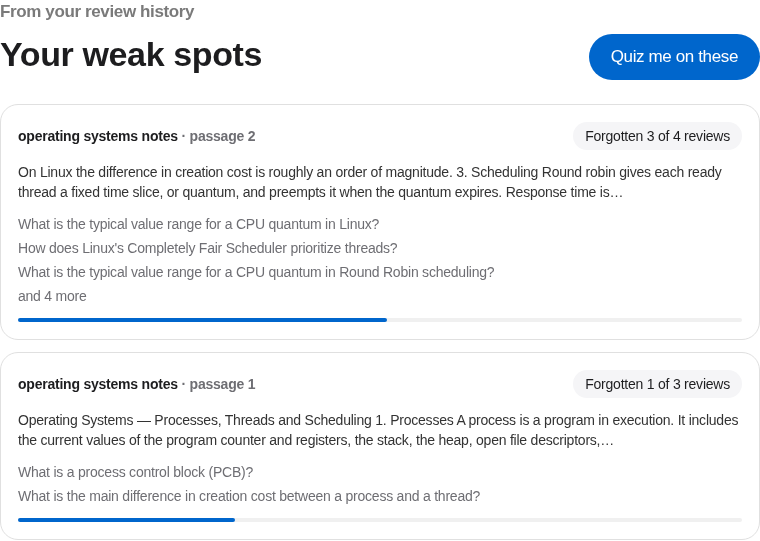
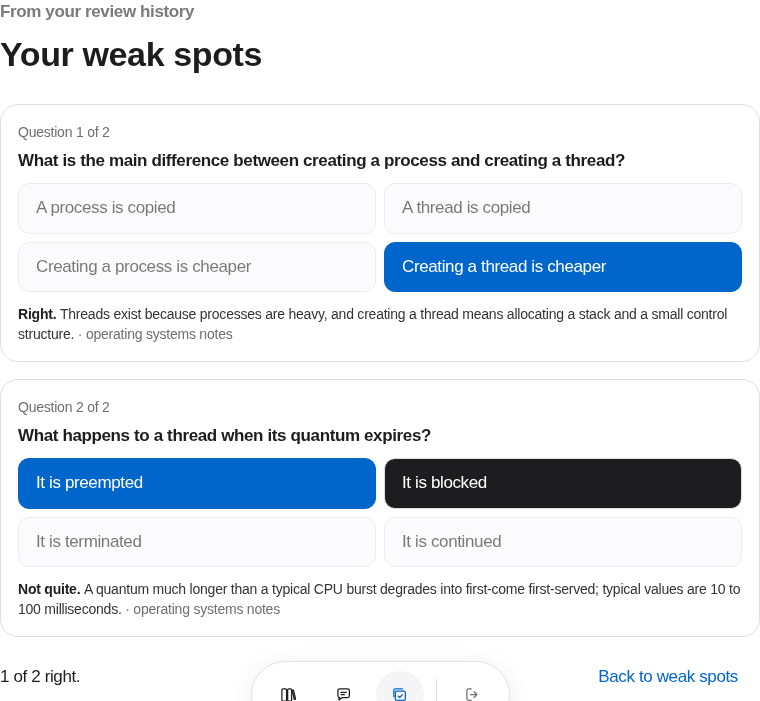

# Built on hackathon day — 27 September 2026

Three features added during the GOMYCODE × NVIDIA "Come Build with AI"
hackathon, on top of the existing Recall app. Each landed as its own pull
request with tests.

## 1. Explain it back

Flashcard apps ask you to grade yourself, and people are generous with
themselves. On the review screen you can now **write the answer in your own
words** and have it checked, fact by fact, against the card.

The result lists which facts you stated, which you missed and which you got
wrong, and suggests an FSRS rating. It never presses the button for you: the
suggestion is advice, and the schedule stays your decision.

**How it grades.** It took four designs to get this reliable, each measured
against labelled answers:

1. *One prompt listing right, missing and wrong points.* `llama3.2:3b` pulled
   facts from the passage instead of the card, filed correct facts under
   "wrong", and gave a wrong answer the same grade as a right one.
2. *The model splits the card into facts, then judges each one three ways.*
   The split changed between calls and sometimes invented a fact, so the same
   answer could earn two grades.
3. *Two yes/no questions per fact on `llama3.2:3b`.* It answered "yes, this
   contradicts the fact" for every answer, including correct ones.
4. **What shipped.** The card's answer is split into facts **in code**, by its
   own punctuation, so the split is deterministic. **Word overlap** decides
   the clear cases without any model call. The model is asked only two narrow
   yes/no questions: "does this answer say the fact?" for paraphrases, and
   "is this claim false?" when the answer introduces a new term. A wrong claim
   always brings one — "glucose", "father", "lower". Judging runs on
   `qwen3:8b` (`GRADER_MODEL`), while chat stays on the faster `llama3.2:3b`.

On eleven labelled answers, `qwen3:8b` with this design graded **10 of 11**
correctly, identically on two runs. The one miss was conservative: a wrong
answer got Hard rather than Again, never Good. Grading a five-fact card takes
about 9 s once the model is loaded, with the facts checked concurrently. An
answer sharing no word with the card returns instantly as "Not yet".

The rating rules are code, so they are tested exactly:

| Answer | Suggested rating |
|---|---|
| every fact, nothing wrong | Good — never Easy, because a grader reading text cannot see how fast you recalled it |
| at least half the facts | Hard |
| less than half, or nothing | Again |
| anything wrong | at most Hard, and Again under half — a confident wrong answer is exactly what spaced repetition must catch |

Known limit: a paraphrase that shares **no** content word with the card's
answer ("passed down maternally" for "inherited from the mother") counts as
missing. A test pins that behaviour so any change to it is deliberate.

`POST /cards/{id}/grade` · 32 tests in `api/tests/test_grading.py`.

## 2. The trust report

Most AI demos say they are accurate. This one measures it.
`python -m evaluation.run` builds a scratch database, uploads a fixed corpus
with real embeddings, asks 20 labelled questions through the real `/chat`
endpoint (12 the notes answer, 8 they don't), grades 28 labelled answers with
the real grader, and writes the numbers to
[`docs/trust-report.md`](trust-report.md) and to the app's
[`/trust`](http://localhost:3100/trust) page. Nothing is mocked.

**It found real problems, and they were fixed before the numbers were
published.** The first run:

| | First run | After fixes |
|---|---|---|
| Off-topic questions refused | 8 / 8 | 8 / 8 |
| Covered questions wrongly refused | 3 / 12 | **1 / 12** |
| Covered questions answered with the right fact | 9 / 12 | **11 / 12** |
| Answers graded with the right verdict (development set) | 11 / 16 | 16 / 16 |
| Wrong answers graded as correct | 1 / 16 | **0 / 28** |

- *Wrong refusals* came from chunking. At 1800 characters a short lecture was
  a single chunk whose embedding averaged every topic in it, so "Where does
  the Calvin cycle run?" scored 0.552, under the 0.6 floor. Measured at four
  sizes, 600 characters took it from three misses to one without letting any
  off-topic question over the floor.
- *Grading errors* came from the contradiction check seeing a fact ("The
  address space") without the question it answered, and from word overlap
  passing "keep running" for "preempts the running thread". The check now gets
  the question and the full answer, and overlap alone decides only when every
  content word of a fact is present.

Because the grader was fixed using those sixteen answers, they now flatter
it. So **twelve held-out answers** were written after the last change and run
once: **10 / 12 correct, and no wrong answer graded as right.** The two misses
are the known limits — a paraphrase with no word in common ("ten times" for
"an order of magnitude") and a fact that bundles two things ("registers and
stack"). They were left unfixed so the held-out number stays honest.

5 tests on the report's own arithmetic in `api/tests/test_evaluation_metrics.py`.

## 3. Weak spots

A review app knows exactly what you keep forgetting, and most never tell you.
Under the card on the review screen, Recall now lists the **passages** your
history says are slipping, then writes a quiz on only those passages.

**A weak spot is a passage, not a card.** Three cards written from the same
paragraph are one gap, and the fix is to reread that paragraph. So cards are
grouped by the passage they came from, and each group is scored from its own
review history:

- **half** is how often its cards were rated Again, the most direct evidence
  there is;
- **three tenths** is FSRS's current chance of recalling them;
- **two tenths** is how difficult FSRS has found them for this student.

A passage appears only if it has been reviewed and was either forgotten or
has faded below 85% recall. One never reviewed is untested, not weak, and the
panel stays hidden rather than guess. The ranking is a pure function, so its
rules are tested directly.

**The quiz checks its own answer key.** The first live run marked "A process
has a lower creation cost" as correct, right next to an explanation saying
the opposite. A wrong key is the worst failure a quiz can have, because it
marks you wrong for being right. So after `llama3.2:3b` writes the questions,
each one is answered again by `qwen3:8b` from the passage alone, without
seeing the key, and any question where the two disagree is dropped. That
check caught both bad keys in a probe while accepting the good one. A second
check, done in code, drops questions whose choices say the same thing ("an
order of magnitude" and "one order of magnitude"), which the model missed.
Asked for three questions, it usually keeps two.

Known limits:

- On a 15 GB CPU-only machine Ollama cannot keep both models loaded, so it
  swaps them on every step. A three-question quiz takes 50 to 80 seconds, and
  the screen says so while it works.
- The check verifies the key, not the explanation. An explanation can still
  wander off the question while the marked answer is right.

`GET /cards/weak-spots` · `POST /study/weak-spots/quiz` (saved to history as a
quiz) · 29 tests in `api/tests/test_weak_spots.py`.
