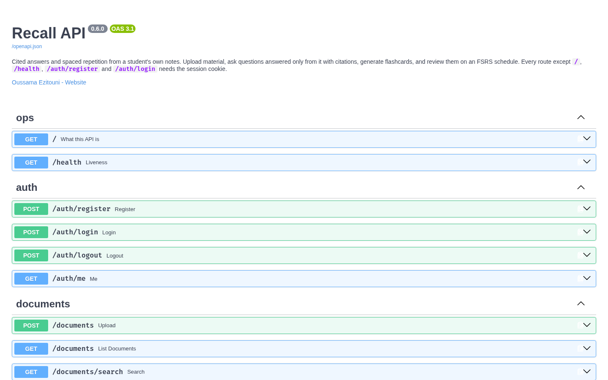
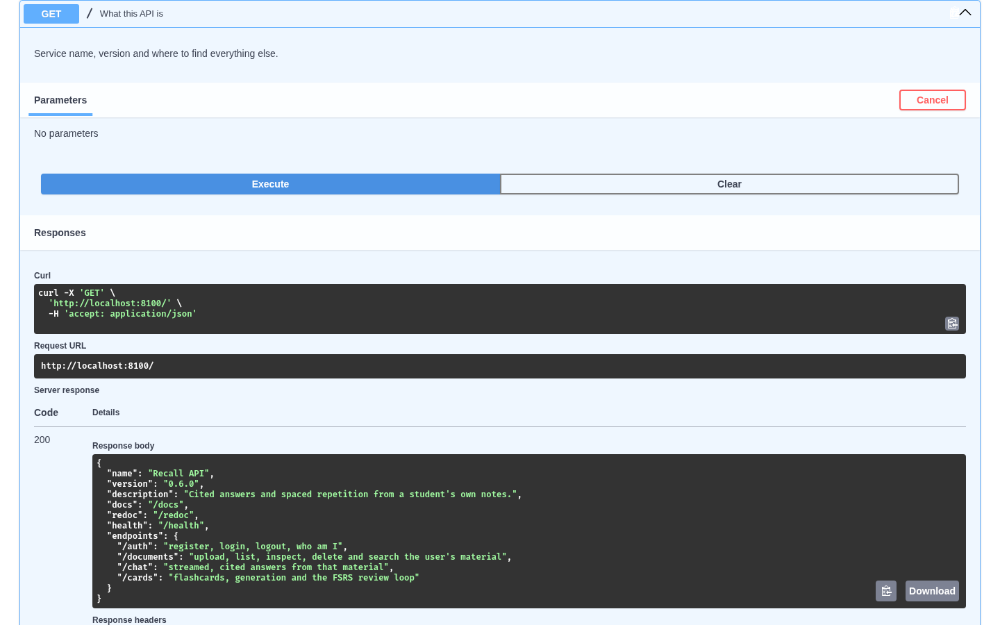
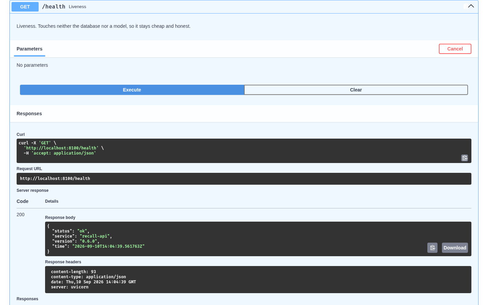

# Phase 2 — FastAPI backend foundation

*Lab phase 2 of 7 · Oussama Ezitouni*

The backend is a FastAPI application in [`api/app/main.py`](../api/app/main.py).
This phase adds the two public endpoints the lab asks for, gives the application
a single source of truth for its version, and records a Swagger UI run.

## What was done

- **`app/main.py`** initialises `FastAPI(title="Recall API", version=__version__, description=…, contact=…)`.
  The version lives once, in [`api/app/__init__.py`](../api/app/__init__.py), and is read by
  `main.py`, `GET /` and `GET /health`, so the three can never disagree.
- **`GET /`** ([`api/app/routers/ops.py`](../api/app/routers/ops.py)) — what this service is:
  name, version, description, where the docs are, and each route family with one line on
  what it does. Returns a typed `ServiceInfo` model, so its shape is in the OpenAPI schema.
- **`GET /health`** — liveness: `status`, `service`, `version`, server `time` (UTC). Typed
  `Health` model. Touches neither the database nor a model, so it is cheap and cannot lie
  about the process being able to answer.
- **Six tests** in [`api/tests/test_ops.py`](../api/tests/test_ops.py): both endpoints answer
  without a cookie, carry the version, the health time is current, Swagger UI is served, and
  the OpenAPI schema carries the title, version and description. Suite total: 99.

## Run it

```bash
cd api
uv venv --python 3.12 && uv pip install -r requirements.txt
cp .env.example .env            # put a SESSION_SECRET in it
.venv/bin/uvicorn app.main:app --port 8100
```

```bash
$ curl localhost:8100/
{"name":"Recall API","version":"0.6.0","description":"Cited answers and spaced repetition from a student's own notes.",
 "docs":"/docs","redoc":"/redoc","health":"/health",
 "endpoints":{"/auth":"register, login, logout, who am I","/documents":"upload, list, inspect, delete and search the user's material",
              "/chat":"streamed, cited answers from that material","/cards":"flashcards, generation and the FSRS review loop"}}

$ curl localhost:8100/health
{"status":"ok","service":"recall-api","version":"0.6.0","time":"2026-09-10T13:59:23.452302Z"}
```

## Swagger UI

http://localhost:8100/docs — every route, grouped by tag, with the request and
response models generated from the code.



`GET /` executed from Swagger:



`GET /health` executed from Swagger, with the response headers:



## An endpoint is not a function

`health()` is an ordinary `async` Python function; anyone can import and call it.
What makes it an *endpoint* is the decorator `@router.get("/health")`: FastAPI
registers the function against an HTTP method and a path, converts the incoming
request into the function's arguments (validating them with Pydantic), converts
the return value into a JSON response with the declared `response_model`, and
publishes all of that in the OpenAPI schema that Swagger UI renders. The function
is the behaviour; the endpoint is the contract around it.
