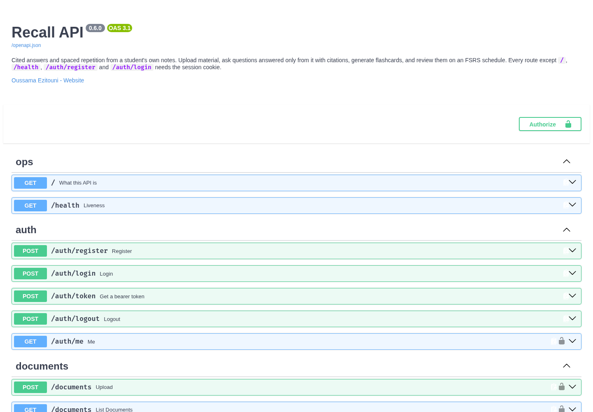
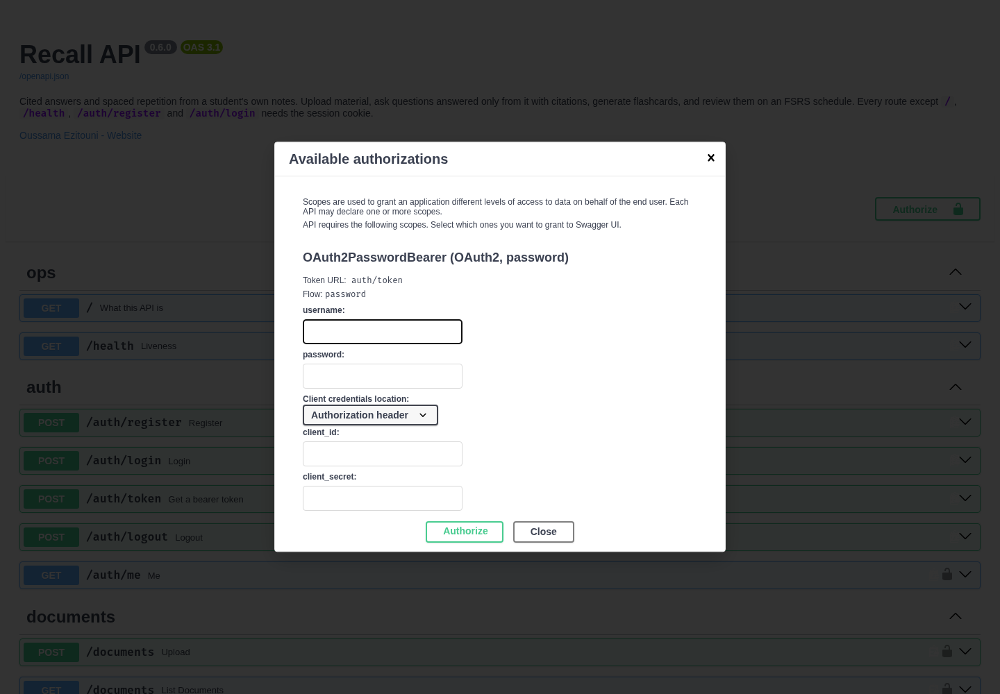
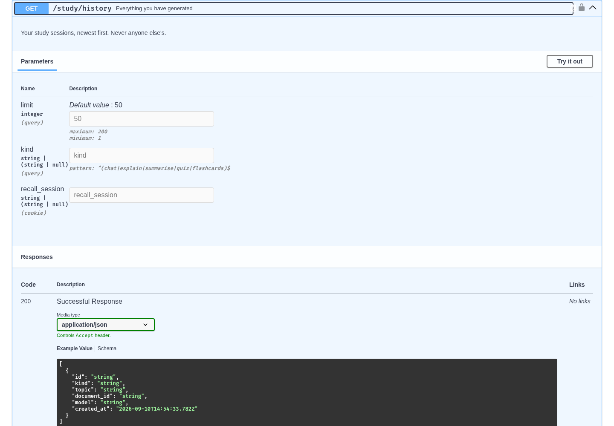

# Phase 4 — Database and authentication

*Lab phase 4 of 7 · Oussama Ezitouni*

Seven tables, two ways to prove who you are, and one rule applied everywhere:
a query for someone else's row returns nothing.

## The tables

```
users ─┬─< sessions            server-side session rows; deleting one signs that browser out
       ├─< documents ─< chunks         uploaded material, split and embedded
       ├─< cards ─< review_logs        flashcards and every rating of them
       └─< study_sessions ─< generated_content     what was asked for, and what came back
```

[`api/app/models.py`](../api/app/models.py). The two added in this phase:

**`study_sessions`** — one thing the student asked the assistant for.
`kind` (chat, explain, summarise, quiz, flashcards), `topic` (the question, or
the title of the material), `model` (which model wrote it — an answer from a 3B
and an 8B model are not the same artefact), `user_id`, an optional
`document_id`, and `created_at`.

**`generated_content`** — what the model produced, one row per artefact.
`text` is what a person reads; `data` is the structured payload (the citations,
the quiz questions, the card fronts and backs) so the history can re-render an
artefact rather than only quote it; `grounded` records whether the assistant
answered or refused.

Two deliberate choices:

- `study_sessions.document_id` is **SET NULL** on delete, like `cards`.
  Deleting a document should not erase the record that you studied it.
- `generated_content.user_id` duplicates the session's owner. Every query here
  is "this user's history", and the ownership filter should not need a join.
  The session row stays the source of truth.

Sessions and contents are timestamped in Python, not by the database. SQLite's
`CURRENT_TIMESTAMP` resolves to whole seconds, so three sessions created in the
same second tied and "newest first" fell back to a random uuid — a list of what
you just did came back shuffled. A test caught it; `documents` had the same
latent bug and was fixed with it.

## Two doors, one house

| | Session cookie | Bearer token |
|---|---|---|
| For | the browser | scripts: the n8n automation, the MCP tool, curl, Swagger |
| Issued by | `POST /auth/login`, `POST /auth/register` | `POST /auth/token` (OAuth2 password flow) |
| Carried in | `recall_session`, HttpOnly, SameSite=Lax, Secure in production | `Authorization: Bearer …` |
| Backed by | a row in `sessions` | nothing — the signature is the proof |
| Revocable | yes, immediately: logout deletes the row | no, so it expires in 12 hours |

Both answer the same question, and nothing downstream knows which was used.
A bearer token wins when both are present: an explicit header is a deliberate
act, where a cookie rides along by default.

The token is a JWT signed HS256 with the service's secret, carrying only
`sub` (the user id), `iat`, `exp`, `jti` and `typ`. No email, no password, no
personal data — a JWT is signed, not encrypted, and anyone holding it can read
its payload.

**How it protects a private route.** `current_user` is a FastAPI dependency
every protected endpoint declares. It reads the `Authorization` header,
verifies the signature against the server's secret and checks the expiry, then
loads the user the token names. A tampered payload no longer matches the
signature; a token minted with another secret fails the same check; an expired
one is rejected by the library. The signature is what makes the token
unforgeable — without it the header is just a claim. The decoder pins
`algorithms=["HS256"]`, because a token whose header says `alg: none` would
otherwise ask the server to accept the attacker's own choice of how to verify
the attacker's token. A valid signature still does not prove the account
exists, so the row is looked up: a token outlives the user it names.

Passwords never enter any of this. They are hashed with **argon2id** at the
library's defaults before the row is written, verified by re-hashing, and
re-hashed automatically on login if the parameters have since been
strengthened.




## Endpoints

| Route | Purpose |
|---|---|
| `POST /auth/register` | create an account, hash the password, sign in |
| `POST /auth/login` | cookie session |
| `POST /auth/token` | bearer token (`username` = email) |
| `POST /auth/logout` | delete the session row and clear the cookie |
| `GET /auth/me` | the signed-in user, from either credential |
| `GET /study/history` | your sessions, newest first, `?kind=` and `?limit=` |
| `GET /study/history/{id}` | one session with its generated content |



History is populated by the flows that already generate content: a chat answer
becomes a `chat` session, a card generation becomes a `flashcards` session.
Phase 5 adds the `/study/*` endpoints that create them explicitly.

The chat endpoint records from a detached database session, because FastAPI
closes the handler's session when it returns the `StreamingResponse` — the
answer is not finished until after that. Passages are stored by reference
rather than in full: the chunk rows already hold the text, and copying five of
them into every history entry would grow the database faster than the library
does.

## One user cannot reach another's history

The ownership filter is part of the query, never a check afterwards:

```python
select(StudySession).where(StudySession.id == session_id, StudySession.user_id == user_id)
```

"Load it, then compare the owner" is the shape that leaks the day someone adds
an early return. Another user's session is a **404**, not a 403: confirming
that an id exists is itself a disclosure.

Live, against the running API — Alice is the demo account, Bob is a second
registration, both using bearer tokens and no cookies at all:

```
alice /study/history
   14:54:12  flashcards  operating systems notes                   model=llama3.2:3b
   14:53:40  chat        What does a process control block hold?   model=llama3.2:3b
alice /study/history/2d723bb5…   grounded: True  citations: [1]  sources: 1
   "A process control block (PCB) holds the process identifier (PID), the saved CPU state…"

bob   /study/history               -> []
bob   /study/history/2d723bb5…     -> 404 {"detail":"No such study session."}
bob   /documents                   -> []

no token          -> 401
tampered token    -> 401
wrong password    -> {"detail":"Email or password is incorrect."}
```

The wrong password and an unknown email return the same sentence, so the
endpoint cannot be used to discover which addresses are registered.

## Tests

**169 total**, 35 added in this phase.

`tests/test_auth_token.py` (19) — a token is issued and works on every
protected route; the email is case-insensitive; a wrong password and an unknown
email fail identically; the token carries no personal data; and it is refused
when it is garbage, tampered with, signed with another secret, unsigned
(`alg: none`), expired, of the wrong type, or names an account that no longer
exists. The cookie still works, and both doors return the same user.

`tests/test_history.py` (16) — an answer becomes a session with its citations,
a refusal is recorded as ungrounded, a card batch is one session, the model is
recorded, deleting a document keeps the session; newest-first ordering, the
`kind` filter, parameter validation; and isolation, checked through both the
cookie and a bearer token.

```bash
cd api && .venv/bin/python -m pytest -q
```
