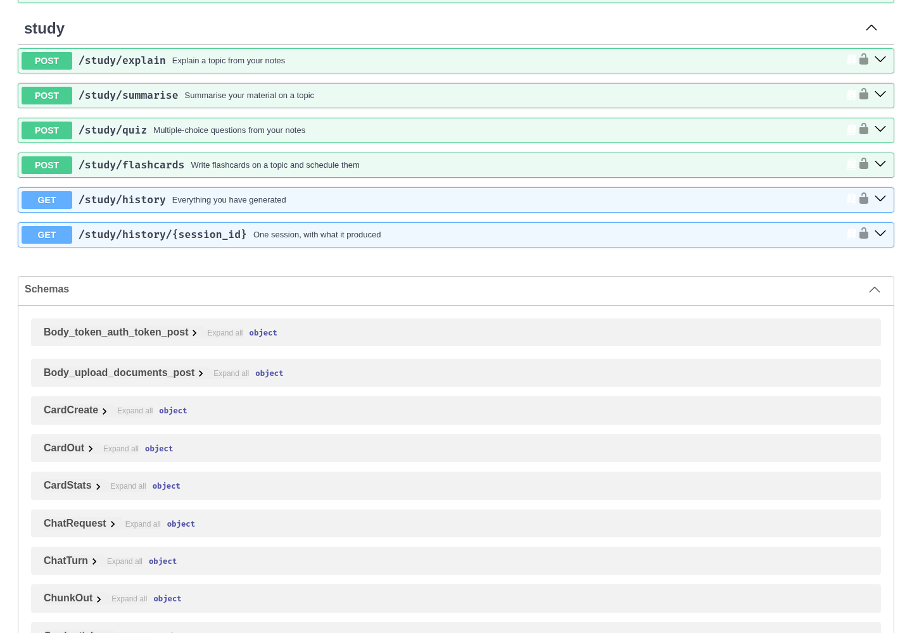
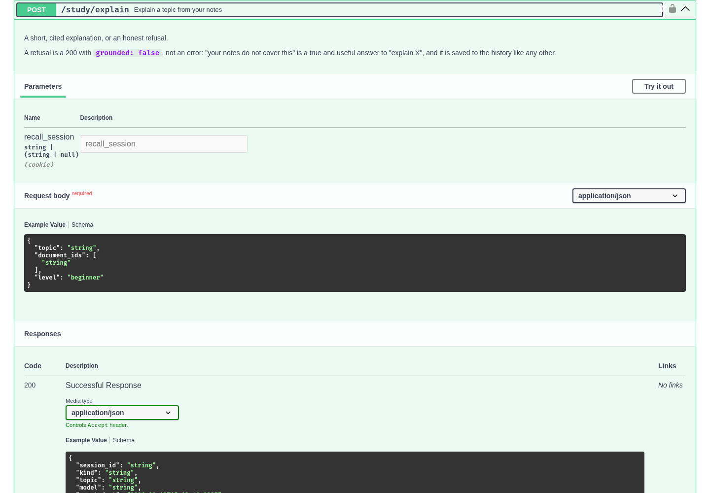

# Phase 5 — Study features and history

*Lab phase 5 of 7 · Oussama Ezitouni*

Four endpoints, one shape: find the passages in this student's own material,
ask the AI service for one kind of study content, save what came back, return
it with the id of the row it was saved as.



## The endpoints

| Route | Body | Returns |
|---|---|---|
| `POST /study/explain` | `topic`, `level`, `document_ids?` | a short cited explanation |
| `POST /study/summarise` | `topic`, `points`, `document_ids?` | at most `points` cited sentences |
| `POST /study/quiz` | `topic`, `count`, `difficulty`, `document_ids?` | multiple-choice questions with the answer marked |
| `POST /study/flashcards` | `topic`, `count`, `document_ids?` | cards, **saved and due now** |
| `GET /study/history` | `?kind=`, `?limit=` | your sessions, newest first |
| `GET /study/history/{session_id}` | | one session and everything it produced |

Every response carries `session_id`, `topic`, `model`, `created_at` and the
`sources` used, so a client can show the citations and link straight to the
history row rather than searching the list for what it just did.

```
request ──► retrieve this user's passages ──► AI service ──► save ──► respond
              (decides refusal, and           (structured    (StudySession +
               scopes everything)              output)        GeneratedContent)
```

Retrieval comes first on purpose. It is what scopes the whole feature to one
user — the search only ever sees chunks whose owner is the caller — and it is
what decides whether the model is asked at all.

## Two decisions worth defending

**A refusal is a 200, an empty quiz is a 422.** "Your notes do not cover this"
is a true and useful answer to *explain X*, so `/study/explain` and
`/study/summarise` return it with `grounded: false` and save it to the
history — a run of refusals says something about the library, and it is worth
being able to see. A caller that asked for five questions, though, has nothing
to render without them, so `/study/quiz` and `/study/flashcards` fail with 422
and a sentence saying what to do about it. If the model is asked and returns
nothing usable, that is a 502: the material was there, the model was not.

**`/study/flashcards` writes real cards.** `/cards/generate` covers a whole
document, passage by passage. This is the topic-shaped door into the same
deck: ask for three cards on scheduling and get three, drawn from wherever
scheduling is discussed, spread across the passages found rather than all
taken from the first. They are `Card` rows, due immediately, so they appear in
the next review session and are scheduled by FSRS like any other.

## Everything is saved

One `StudySession` per request, with a `GeneratedContent` row holding both the
prose and the structure: the citations for an explanation, the points and
title for a summary, the whole quiz for a quiz, the card ids for flashcards.
A session is linked to a document only when every passage came from the same
one — a link to the first of three would be noise.

## Live

`llama3.2:3b` on CPU, against a two-passage document of operating-systems
notes, using a bearer token:

```
POST /study/explain      200 in 10s   grounded, cites [1]
  "A process control block (PCB) is a data structure that stores information about a process.
   It holds the process identifier (PID)…"

POST /study/summarise    200 in 20s   4 points, cites [1, 2]
  - A process is a program in execution, including the program counter and registers, the stack…
  - A thread is a unit of execution inside a process, sharing the address space, heap, open files…
  - Creating a process means copying page tables…, while creating a thread means allocating a stack…
  - Linux's Completely Fair Scheduler keeps ready threads in a red-black tree ordered by virtual runtime…

POST /study/quiz         200 in 48s   3 questions, every key correct
  Q: What is the main difference in creating a process versus creating a thread?
     → "Creating a thread means allocating a stack and a small control structure"   source [2]
  Q: What is the purpose of the Completely Fair Scheduler?
     → "To give priority to threads with the smallest virtual runtime"              source [2]

POST /study/flashcards   201 in 12s   3 cards, saved and due now
  Q: What is the typical value range for a CPU quantum in Linux?   A: 10 to 100 milliseconds
  Q: How does Linux's Completely Fair Scheduler order ready threads?  A: by virtual runtime, weighted by priority

GET  /study/history      12 sessions, newest first
  15:11:34  flashcards   round robin scheduling
  15:11:21  quiz         processes and threads
  15:10:37  summarise    threads and scheduling
  15:10:14  explain      what a process control block holds

explain("the rules of cricket")   → 200, "I can't find that in your notes.", grounded false, 0 sources
quiz("the rules of cricket")      → 422 "Nothing in your material covers that closely enough…"
explain(topic="ab")               → 422 before any retrieval or model time
no credential                     → 401
```



## Validation

`topic` is 3–500 characters after stripping, because it is also the retrieval
query: `"a"` would match noise, and asking a model to explain it would spend a
minute of CPU on nothing. `points` is 1–12, `count` 1–20, `level` and
`difficulty` are enumerations, `document_ids` at most 20. All of it is
declared on the Pydantic request models, so a bad request is a 422 before any
work starts and the rules appear in the OpenAPI schema.

## Tests

**221 total**, 52 added here (`api/tests/test_study.py`), none needing a model
or a network:

- each endpoint returns its structured payload and the passages behind it;
- the level, point limit, question count and difficulty reach the model;
- material that does not cover the topic refuses without calling the model, and the refusal is saved;
- everything generated appears in the history with its structure intact;
- flashcards become real rows that show up in `/cards` and `/cards/due`, never more than asked, pointing back at the passage they came from;
- 32 validation cases: empty, whitespace, too-short and too-long topics against all four endpoints, and every out-of-range option;
- a document filter limits the passages used; one user cannot study another's material; every endpoint works with a bearer token and refuses without a credential;
- an unreachable model is a 502 carrying a sentence for the student, on all four.

```bash
cd api && .venv/bin/python -m pytest -q
```
