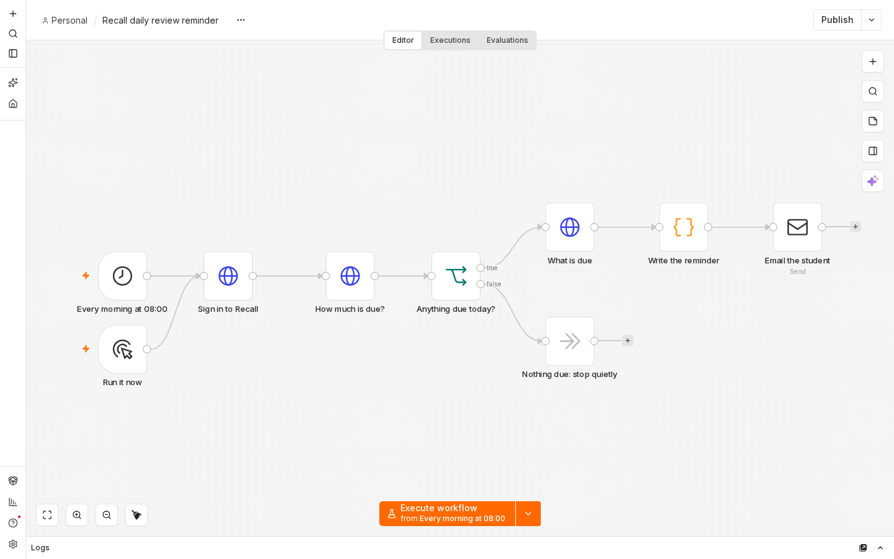
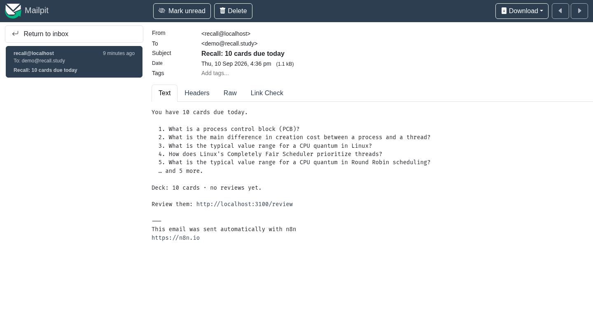

# Phase 6 — Async, automation, and an MCP tool

*Lab phase 6 of 7 · Oussama Ezitouni*

Three additions: model calls that fail usefully when they are slow, a
scheduled email that brings the student back, and an MCP server that lets
another assistant use their notes.

## 1. Async, and what happens when the model is slow

Every model call has been `async` since phase 3, and `/chat` streams. What was
missing is the difference between *not there* and *too slow* — both used to
surface as one 502 saying "is Ollama running?", which is unhelpful advice when
Ollama is running and simply busy.

**Two timeouts, because they mean different things.** A connection that is not
accepted in 5 seconds will not be accepted in 300; a model that has accepted
the request and is writing deserves the long budget. `httpx.Timeout(read,
connect=5)` splits them.

**Two failures, two status codes.**

| | | Status | What the student is told |
|---|---|---|---|
| `AiUnavailable` | the provider is not listening | 502 | "The model could not be reached. Is Ollama running with the chat model pulled?" |
| `AiTimeout` | it accepted the request and stalled | 504 | "The model (llama3.2:3b) took longer than 300 seconds to answer. Try a shorter topic, fewer items, or a faster model such as llama3.2:3b." |

`AiTimeout` subclasses `AiUnavailable`, so a caller that only cares *that* it
failed still needs one `except`.

**A belt as well as braces.** The HTTP read timeout is reset by every byte that
arrives, so a provider dribbling one byte a minute would never finish and never
fail. `asyncio.wait_for` caps the whole call regardless of how the bytes
arrive.

Mid-stream is a special case: by the time `/chat` is writing tokens the
response has started and a 504 is no longer possible, so the timeout arrives as
an `error` event the client can render.

Measured on `llama3.2:3b`, CPU: explanation ~10 s, summary ~20 s, quiz ~50 s,
checklist ~15 s. The 300-second ceiling is for the worst case, not the common
one.

## 2. The automation: a daily review reminder

Spaced repetition only works if you come back. This is the part that asks.



```
08:00 daily  →  POST /auth/token  →  GET /cards/stats  →  due_now > 0 ?
                                                            │ no  → stop, no email
                                                            │ yes
                                          GET /cards/due?limit=5  →  compose  →  email
```

**Trigger** a schedule, plus a manual trigger for demonstrating.
**Action** four API calls and an SMTP send.
**Result** this, delivered to a real SMTP server (Mailpit) on the same machine:

```
Subject: Recall: 10 cards due today

You have 10 cards due today.

  1. What is a process control block (PCB)?
  2. What is the main difference in creation cost between a process and a thread?
  3. What is the typical value range for a CPU quantum in Linux?
  4. How does Linux's Completely Fair Scheduler prioritize threads?
  5. What is the typical value range for a CPU quantum in Round Robin scheduling?
  … and 5 more.

Deck: 10 cards · no reviews yet.

Review them: http://localhost:3100/review
```



Nothing due means no email at all — a reminder that arrives when there is
nothing to do teaches people to ignore reminders.

The workflow authenticates with a **bearer token**, which is why phase 4 added
them: n8n has no cookie jar. The email and password are read at run time from
`$env`, so the committed `automation/n8n/workflow.json` contains no
credential. Setup and the port choices are in
[`automation/README.md`](../automation/README.md).

## 3. The MCP tool

[`mcp-server/`](../mcp-server) is an MCP server exposing one student's Recall
account to any host that speaks the protocol.

```python
@mcp.tool(annotations=READ_ONLY)
async def generate_revision_checklist(topic: str, items: int = 6) -> dict:
    """Build a revision checklist for a topic from the student's own notes."""
```

Structured output, from a real run against the live API and `llama3.2:3b`:

```json
{
  "topic": "threads and processes",
  "items": [
    {"n": 1, "step": "Recall the definition of a process",
     "why": "establishes the foundation for the rest of the material",
     "source": "operating systems notes, part 1"},
    {"n": 2, "step": "Sketch the process states (new, ready, running, waiting, terminated) and explain their transitions",
     "why": "visualizes the process lifecycle and helps solidify the order of events",
     "source": "operating systems notes, part 1"},
    {"n": 3, "step": "Explain the difference between a process and a thread",
     "why": "distinguishes between two related but distinct concepts",
     "source": "operating systems notes, part 1"}
  ],
  "based_on": ["operating systems notes"],
  "saved_as": "5953c429-4189-4ea0-a68c-24e57c28fc54"
}
```

Two supporting tools come with it — `search_notes` to find out what the student
has, `explain_topic` to answer from the same material — plus a
`recall://documents` resource listing the library.

**The server is a client of the API, not a second copy of its logic.** It signs
in with `POST /auth/token` and holds the bearer token, re-authenticating once
if it expires mid-session. The same checklist is reachable over HTTP at
`POST /study/checklist` for anything that is not an MCP host.

**Security.** Credentials come from the environment, never from a tool
argument: an argument is chosen by the model, and a model should not be able to
send a password anywhere nor receive one back. All three tools are annotated
`read_only_hint`, so a host need not ask for a confirmation it does not need.
Arguments are validated in the tool, before the API is called, so a typo costs
no model time.

Behind it, the AI service gained its fifth function,
`generate_revision_checklist(topic, sources, items)`. The first version copied
one `why` into every step — the small model latched onto the single example in
the prompt — so the prompt now shows three varied examples and says outright
that each step needs its own reason.

## Tests

**275 in total**, and none of them need a model, a network or a container.

- `api/tests/` — 255. New here: the checklist function and endpoint, the two
  failure modes (a read timeout, and a model that simply never answers), 504
  on all five study endpoints with a message naming the budget, and a
  mid-stream timeout arriving as an `error` event.
- `mcp-server/test_server.py` — 20, against an `httpx.MockTransport` standing
  in for the Recall API: the tool contracts, six kinds of bad argument refused
  before the API is called, the API's own sentence passed through on failure,
  an expired token replaced once and the call retried, and two assertions that
  no credential can enter or leave through a tool.

CI runs all three suites — `api`, `mcp`, `web` — on every push.

```bash
cd api && .venv/bin/python -m pytest -q
cd mcp-server && .venv/bin/python -m pytest -q
```
